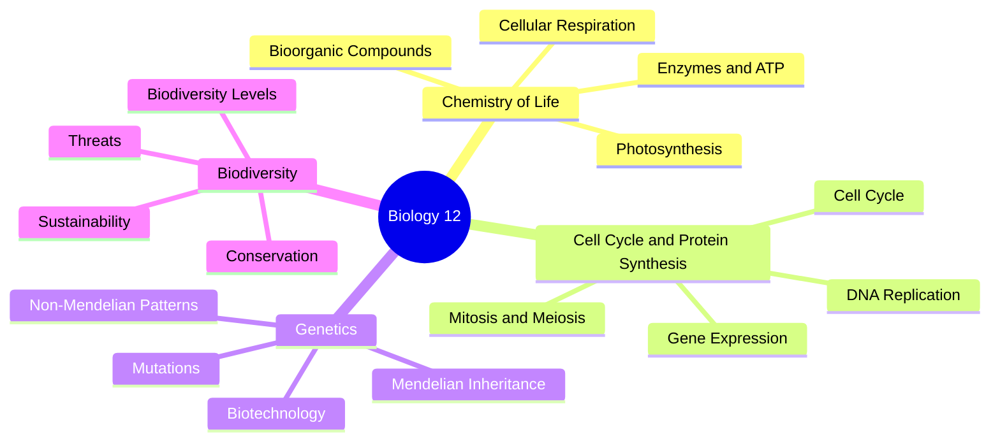
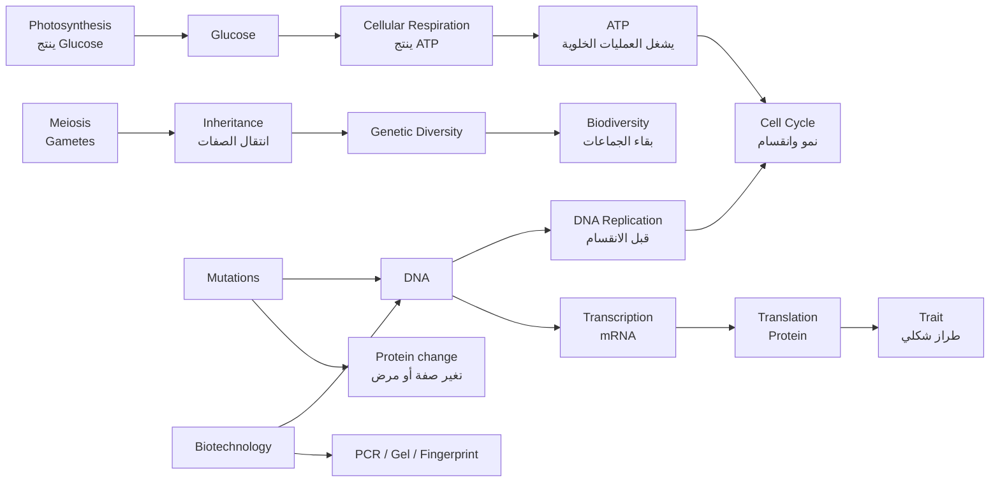

# Biology 12 - Study Map

## Overview
هذه الملاحظات مرتبة حسب وحدات كتاب العلوم الحياتية للصف الثاني عشر، ومركزة على ما يحتاجه الطالب للحفظ والفهم وحل أسئلة الامتحان.

## Units
| File | Unit | Main Focus |
| ---- | ---- | ---------- |
| `01-chemistry-of-life.md` | كيمياء الحياة | Bioorganic Compounds، الإنزيمات، ATP، التنفس الخلوي، البناء الضوئي |
| `02-cell-cycle-and-protein-synthesis.md` | دورة الخلية وتصنيع البروتينات | Cell Cycle، الانقسام، DNA Replication، التعبير الجيني |
| `03-genetics.md` | الوراثة | قوانين مندل، الأنماط غير المندلية، الطفرات، الاختلالات، Biotechnology |
| `04-biodiversity.md` | التنوع الحيوي والمحافظة عليه | مستويات التنوع، الأخطار، الحفظ، الاستدامة |
| `05-final-exam-focus.md` | Final Exam Focus | أنماط الأسئلة والأولويات المتكررة |

## How to Study
- احفظ التعريفات والمصطلحات كما هي، خصوصا المصطلحات الإنجليزية التي تظهر في الكتاب.
- ركز على الجداول والمقارنات؛ أسئلة الامتحان غالبا تطلب تمييز مفهومين متشابهين.
- في العمليات الحيوية، احفظ: المكان، الترتيب، المواد الداخلة، المواد الناتجة، والإنزيمات أو الجزيئات المهمة.
- في الوراثة، لا تحفظ النسب فقط؛ تدرب على استنتاج الطراز الجيني من النسبة أو شجرة النسب أو جدول النتائج.
- في الرسوم، اسأل نفسك: ماذا يمثل كل رمز؟ ما الاتجاه؟ ما الخطوة؟ وما الناتج؟

## High-Priority Skills
- تمييز الصيغ البنائية للكربوهيدرات والليبيدات والبروتينات والحموض النووية.
- تفسير عمل الإنزيم والعوامل المؤثرة فيه.
- حساب نواتج ATP وNADH وFADH2 وNADPH عند تكرار العمليات.
- ترتيب خطوات DNA Replication وTranscription وTranslation.
- حل مسائل Mendelian inheritance وNon-Mendelian inheritance.
- تمييز أنواع mutations والاختلالات الكروموسومية.
- ربط أمثلة التنوع الحيوي بالأخطار وطرق الحفظ.

## Subject-Level Diagrams
### Full Biology Study Map
استخدم هذه الخريطة لتحديد مكان كل وحدة في الصورة الكبرى قبل الدخول في التفاصيل.

### Cross-Topic Relationship Map
هذه الخريطة تربط الوحدات؛ أسئلة الامتحان قد تنتقل من DNA إلى البروتينات أو من Meiosis إلى الوراثة.

