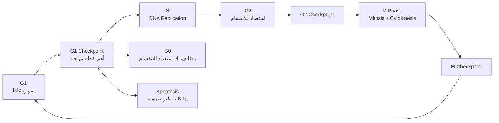
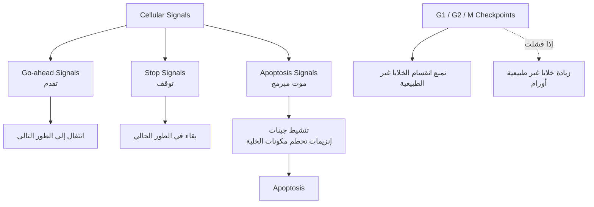
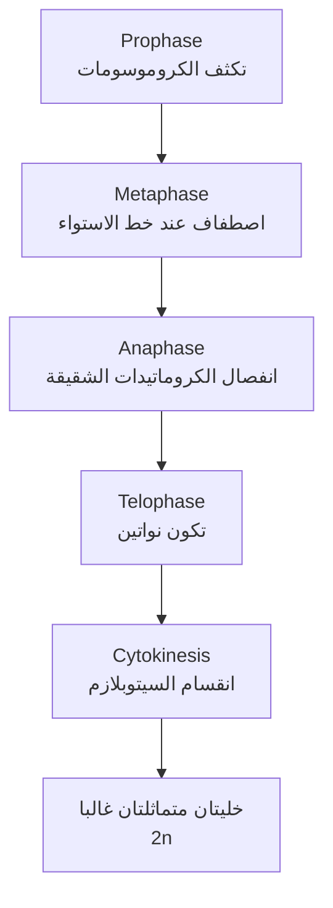
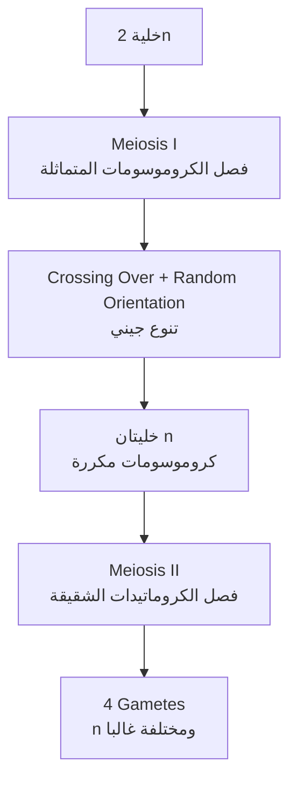
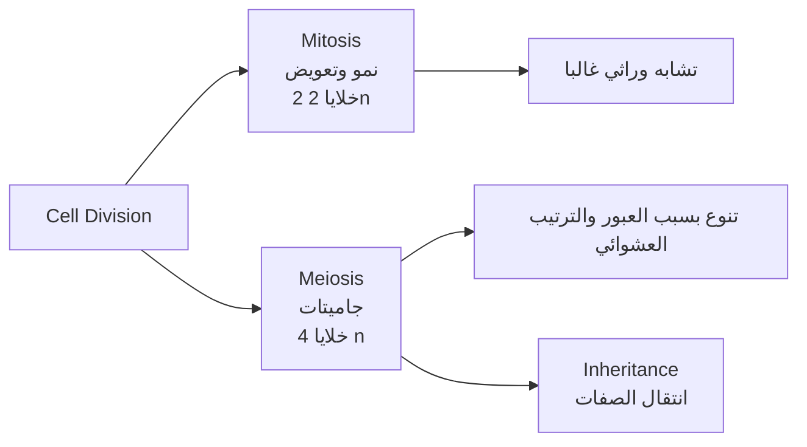
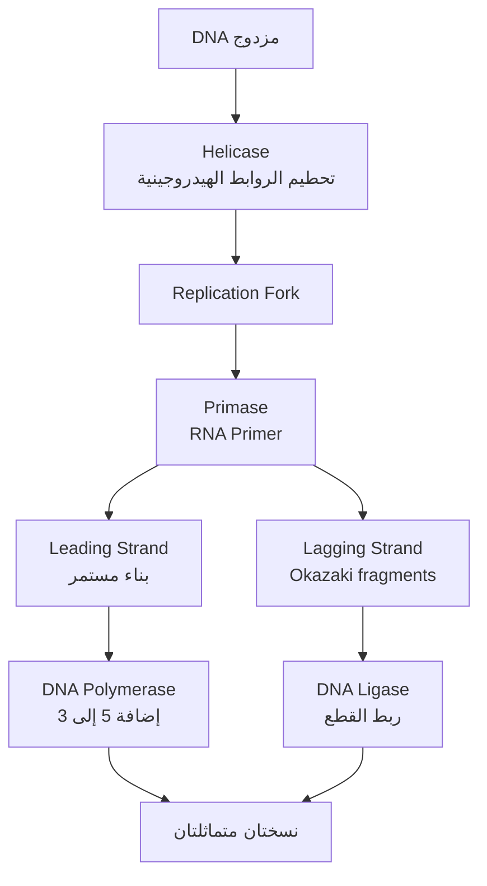
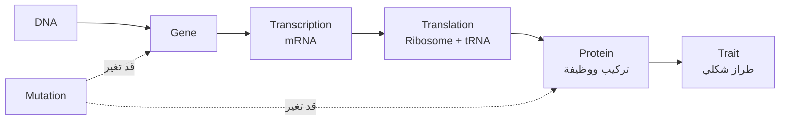

# Unit 2: دورة الخلية وتصنيع البروتينات

## Overview
تركز الوحدة على مراحل حياة الخلية، تنظيم الانقسام، تضاعف DNA، وانتقال المعلومات الوراثية من DNA إلى RNA ثم إلى بروتين.

## Study Diagrams
### Full Cell Cycle Flow
الفكرة الأساسية: لا تدخل الخلية مرحلة جديدة إلا إذا اجتازت نقاط المراقبة المناسبة.

### Signals, Checkpoints, and Apoptosis
هذه خريطة قرار: الإشارات تحدد هل تستمر الخلية، تتوقف، أو تموت موتا مبرمجا.

### Mitosis Process
الانقسام المتساوي يحافظ غالبا على عدد الكروموسومات وينتج خليتين متماثلتين.

### Meiosis Process
الانقسام المنصف ينتج جاميتات، ولذلك يرتبط مباشرة بالوراثة.

### Mitosis vs Meiosis

### DNA Replication

### DNA to Trait

## Key Terms
| Term | Meaning |
| ---- | ------- |
| Cell Cycle | دورة حياة الخلية من نمو وانقسام. |
| Interphase | الطور البيني، ويشمل G1 وS وG2. |
| M Phase | مرحلة الانقسام الخلوي. |
| Cyclin | بروتين تنظيمي يتغير تركيزه خلال دورة الخلية. |
| Cdk | إنزيم فسفرة يعتمد على Cyclin لتنشيطه. |
| Checkpoint | نقطة ضبط تمنع تقدم الدورة إذا وجدت مشكلة. |
| G0 Phase | الطور الصفري؛ طور سكون تخرج إليه الخلية من G1 عند غياب إشارات الاستمرار في الدورة. |
| Cellular Signals | إشارات خلوية داخلية أو خارجية تنظم تقدم الخلية أو توقفها أو موتها المبرمج. |
| Go-ahead Signals | إشارات تقدم تسمح للخلية بالانتقال إلى طور تال. |
| Stop Signals | إشارات توقف تمنع انتقال الخلية إلى الطور التالي. |
| Apoptosis Signals | إشارات تنشط جينات تنتج إنزيمات تحطم مكونات الخلية فتؤدي إلى موتها المبرمج. |
| Mitosis | انقسام خلوي ينتج خليتين متماثلتين وراثيا غالبا. |
| Meiosis | انقسام منصف ينتج جاميتات أحادية المجموعة الكروموسومية. |
| DNA Replication | تضاعف DNA لإنتاج نسختين متماثلتين. |
| Leading Strand | سلسلة تبنى باستمرار باتجاه شوكة التضاعف. |
| Lagging Strand | سلسلة تبنى على شكل قطع Okazaki. |
| RNA Primer | بادئ RNA يوفر بداية لإضافة النيوكليوتيدات. |
| Transcription | نسخ المعلومات من DNA إلى RNA. |
| Translation | ترجمة mRNA إلى سلسلة عديد ببتيد. |
| Codon | ثلاث قواعد على mRNA تحدد حمضا أمينيا أو إشارة توقف. |
| Anticodon | ثلاث قواعد على tRNA تتكامل مع Codon. |

## Main Ideas
- ليست كل الخلايا نشطة في الانقسام؛ بعض الخلايا تبقى في G0 مثل خلايا عصبية أو عضلية متخصصة.
- الخلية في G0 تقوم بوظائفها وأنشطتها المعتادة، لكنها لا تقوم بالأنشطة التي تهيئها للانقسام.
- تضاعف DNA يحدث في مرحلة S قبل الانقسام.
- تنظيم دورة الخلية يعتمد على Cyclins وCdks ونقاط ضبط.
- بناء DNA يتم دائما بإضافة نيوكليوتيدات إلى النهاية 3'، لذلك تختلف طريقة بناء Leading وLagging strands.
- التعبير الجيني يعني استخدام معلومات الجين لإنتاج بروتين أو RNA وظيفي.
- ترتيب انتقال المعلومات: DNA -> RNA -> Protein.

## Important Rules and Facts
- الطور البيني ليس طور راحة فقط؛ تحدث فيه معظم أنشطة الخلية.
- G1: نمو ونشاط خلوي، S: تضاعف DNA، G2: استعداد للانقسام.
- تخرج الخلية من G1 إلى G0 عند غياب الإشارات الخلوية التي تحفزها على الاستمرار في الدورة.
- بعض الخلايا لا تغادر G0 بعد دخولها فيه، وبعضها يمكن أن يعود للدورة إذا وصلت إشارات مناسبة.
- Cdk لا يعمل وحده بكفاءة؛ يرتبط مع Cyclin ثم يفسفر بروتينات هدف.
- نقاط المراقبة الرئيسة في دورة الخلية هي G1 وG2 وM.
- G1 Checkpoint أهم نقاط المراقبة لأنها تحدد دخول الخلية مرحلة تضاعف DNA أو خروجها إلى G0 أو موتها المبرمج.
- غياب نقاط المراقبة أو فشلها يسمح بدخول خلايا غير طبيعية في الانقسام وزيادة أعدادها، وقد يساهم في ظهور الأورام السرطانية.
- الخلية الطلائية المبطنة للمريء مثال على خلايا نشطة في الانقسام مقارنة بالخلايا العصبية أو العضلية القلبية.
- إذا وجدت خلية في الطور الانفصالي الثاني وتحوي 12 كروموسوما، فإن نهاية الطور التمهيدي الأول في الكائن نفسه تكون 12 كروموسوما و4 مريكزات في الخلية.
- DNA Polymerase يضيف النيوكليوتيدات ويصنع روابط فوسفاتية ثنائية الإستر.
- Helicase يحطم الروابط الهيدروجينية بين القواعد.
- DNA Ligase يربط قطع Okazaki.
- Primase يصنع RNA Primer.
- Leading strand أسرع لأنها تعتمد على بادئ واحد في البداية غالبا.
- Lagging strand أبطأ لأنها تحتاج بادئات متعددة وقطع Okazaki ثم ربطها.
- في PCR، عدد النسخ يتضاعف كل دورة: بعد n دورات يكون العدد `2^n` إذا بدأت بنسخة واحدة. إنتاج 2048 نسخة يعني 11 دورة.

## Important Processes
### Cell Cycle
1. G1: نمو الخلية وتصنيع مواد لازمة.
2. S: تضاعف DNA.
3. G2: استكمال الاستعداد للانقسام وفحص DNA.
4. M: الانقسام النووي ثم السيتوبلازمي.

### تنظيم دورة الخلية بواسطة Cyclin وCdk
1. يرتفع تركيز Cyclin في مرحلة معينة.
2. يرتبط Cyclin مع Cdk.
3. ينشط المركب ويفسفر بروتينات هدف.
4. يؤدي ذلك إلى انتقال الخلية إلى مرحلة تالية إذا اجتازت نقطة الضبط.

### الإشارات الخلوية ونقاط المراقبة
1. تستقبل الخلية إشارات داخلية وخارجية.
2. Go-ahead Signals تسمح بالانتقال إلى الطور التالي.
3. Stop Signals توقف الخلية في الطور الحالي.
4. Apoptosis Signals تنشط جينات تنتج إنزيمات تحطم مكونات الخلية.
5. Checkpoints في G1 وG2 وM تفحص جاهزية الخلية وتمنع تقدم الخلايا غير الطبيعية.

### Mitosis
1. Prophase: تكثف الكروموسومات وتكون خيوط المغزل.
2. Metaphase: تصطف الكروموسومات عند خط الاستواء.
3. Anaphase: تنفصل الكروماتيدات الشقيقة.
4. Telophase: تتكون نواتان.
5. Cytokinesis: ينقسم السيتوبلازم.

### Meiosis
1. Meiosis I يفصل الكروموسومات المتماثلة.
2. Meiosis II يفصل الكروماتيدات الشقيقة.
3. الناتج أربع خلايا أحادية المجموعة الكروموسومية.
4. التنوع ينتج من العبور والترتيب العشوائي للكروموسومات.

### DNA Replication
1. يفك Helicase التفاف DNA ويحطم الروابط الهيدروجينية.
2. تتكون شوكة التضاعف.
3. يصنع Primase بادئ RNA.
4. يضيف DNA Polymerase النيوكليوتيدات باتجاه 5' إلى 3'.
5. تبنى Leading strand باستمرار.
6. تبنى Lagging strand على شكل Okazaki fragments.
7. يربط DNA Ligase القطع.

### Transcription
1. يرتبط RNA Polymerase بمنطقة البداية.
2. تستطيل سلسلة RNA باستخدام سلسلة DNA القالب.
3. تبنى RNA باتجاه 5' إلى 3'.
4. ينفصل RNA عند منطقة النهاية.
5. في حقيقيات النوى يعالج RNA قبل الترجمة.

### Translation
1. يبدأ الريبوسوم بقراءة mRNA عند Start codon غالبا AUG.
2. يحمل tRNA حمضا أمينيا ويتكامل Anticodon مع Codon.
3. تتكون روابط Peptide بين الأحماض الأمينية.
4. يتحرك الريبوسوم على mRNA.
5. تنتهي الترجمة عند Stop codon.

## Comparisons
| Concept A | Concept B |
| --------- | --------- |
| Mitosis: خليتان غالبا متماثلتان وثنائيتا المجموعة | Meiosis: أربع خلايا غالبا مختلفة وأحادية المجموعة |
| Chromosome: تركيب كامل يحتوي DNA وبروتينات | Chromatid: نسخة من الكروموسوم بعد التضاعف |
| Homologous chromosomes: زوج يحمل الجينات نفسها في المواقع نفسها | Sister chromatids: نسختان متماثلتان من كروموسوم واحد |
| Leading strand: بناء مستمر | Lagging strand: بناء متقطع على قطع Okazaki |
| Transcription: DNA إلى RNA | Translation: mRNA إلى Protein |
| Codon: على mRNA | Anticodon: على tRNA |
| G0: وظائف خلوية بلا استعداد للانقسام | G2: استعداد مباشر للانقسام بعد تضاعف DNA |
| Go-ahead signal: تقدم الدورة | Stop/Apoptosis signal: توقف الدورة أو موت مبرمج |

## Exam Focus
- أسئلة الرسوم قد تطلب تمييز Cyclin وCdk والبروتين الهدف؛ ركز على أن Cdk إنزيم فسفرة وCyclin ينشطه.
- إذا سئلت عن سبب الأورام، اربطها بفشل نقاط المراقبة أو استمرار الانقسام رغم وجود خلل.
- لا تصف G0 بأنه توقف كامل لنشاط الخلية؛ هو توقف عن أنشطة التحضير للانقسام فقط.
- احفظ وظائف إنزيمات DNA Replication: Helicase، DNA Polymerase، Ligase، Primase.
- انتبه لاتجاهات 5' و3' في DNA وRNA؛ كثير من الأسئلة تقرأ التسلسل من اليمين إلى اليسار أو العكس.
- في حساب PCR: اربط العدد بالقوة المناسبة للعدد 2.
- في أسئلة الكروموسومات، فرق بين كروموسوم وكروماتيد ومريكز.

## Quick Review Questions
1. ما مراحل الطور البيني؟
2. ما وظيفة Cdk؟
3. لماذا تبنى Lagging strand على قطع؟
4. ما الفرق بين Mitosis وMeiosis؟
5. ما وظيفة RNA Polymerase؟
6. ماذا يعني Codon؟
7. كم دورة PCR تنتج 2048 نسخة من نسخة واحدة؟

## Short Answers
1. G1 وS وG2.
2. إنزيم يفسفر بروتينات هدف بعد تنشيطه بواسطة Cyclin.
3. لأن DNA Polymerase يبني فقط باتجاه 5' إلى 3'، بينما اتجاه السلسلة معاكس لاتجاه شوكة التضاعف.
4. Mitosis ينتج خليتين متماثلتين غالبا، وMeiosis ينتج أربع جاميتات أحادية ومختلفة غالبا.
5. نسخ RNA اعتمادا على سلسلة DNA القالب.
6. ثلاث قواعد على mRNA تحدد حمضا أمينيا أو توقف الترجمة.
7. 11 دورة.
