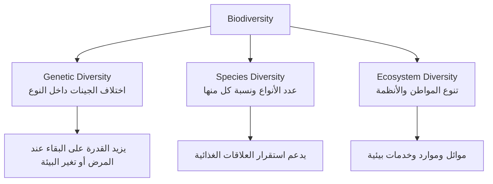
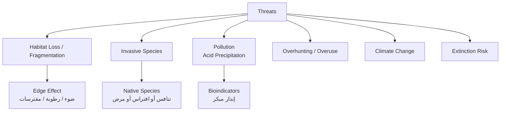
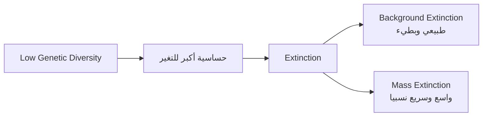
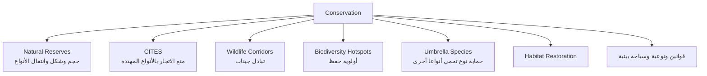
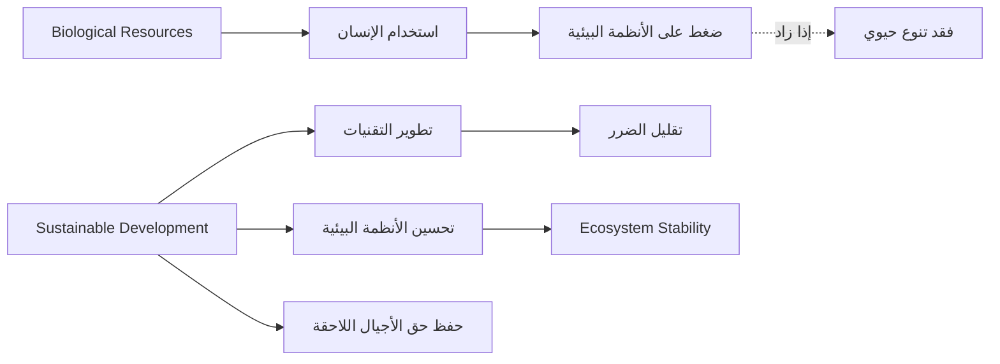

# Unit 4: التنوع الحيوي والمحافظة عليه

## Overview
تشرح الوحدة مستويات التنوع الحيوي وأهميته، الأخطار التي تهدده، وطرق المحافظة عليه واستدامته في الأنظمة البيئية.

## Study Diagrams
### Biodiversity Levels

### Threats to Biodiversity

### Extinction Types

### Conservation Methods

### Sustainability Relationship

## Key Terms
| Term | Meaning |
| ---- | ------- |
| Biodiversity | تنوع أشكال الحياة على مستويات الجينات والأنواع والأنظمة البيئية. |
| Genetic Diversity | تنوع الجينات داخل النوع الواحد. |
| Species Diversity | تنوع الأنواع في مجتمع أو نظام بيئي. |
| Ecosystem Diversity | تنوع الأنظمة البيئية والموائل. |
| Habitat Loss | فقدان الموطن أو تدميره. |
| Habitat Fragmentation | تجزئة الموطن إلى أجزاء أصغر منفصلة. |
| Invasive Species | نوع دخيل ينتشر ويؤثر في الأنواع المحلية. |
| Extinction | انقراض النوع نهائيا. |
| Conservation | حفظ التنوع الحيوي وحماية الأنواع والموائل. |
| Protected Area / Natural Reserves | منطقة محمية أو محمية طبيعية لحماية كائنات أو أنظمة بيئية، خصوصا الأنواع المستوطنة أو المهددة. |
| Sustainable Development | تنمية تلبي حاجات الحاضر دون الإضرار بقدرة الأجيال القادمة. |
| Background Extinction | الانقراض المتدرج الطبيعي بمعدل بطيء. |
| Mass Extinction | الانقراض الجماعي؛ اختفاء عدد كبير من الأنواع خلال مدة جيولوجية قصيرة نسبيا. |
| Native Species | أنواع مستوطنة تعيش طبيعيا في منطقة معينة. |
| Invasive Species | أنواع غازية تدخل منطقة جديدة وتنافس الأنواع المستوطنة أو تؤثر فيها. |
| Edge Effect | تغير ظروف الحدود البيئية الناتج من تجزئة الموطن. |
| Acid Precipitation | الهطل الحمضي الناتج من ملوثات تتفاعل في الجو وتعود مع المطر أو الثلج أو الضباب. |
| Bioindicators | مؤشرات حيوية تستخدم للدلالة على حالة النظام البيئي أو مستوى التلوث. |
| Biodiversity Hotspot | منطقة ذات تنوع عال وأنواع متوطنة كثيرة ومهددة بفقد الموائل. |
| Wildlife Corridor | ممر يربط مواطن مجزأة ليسمح بحركة الأفراد وتبادل الجينات. |
| Umbrella Species | نوع تؤدي حمايته إلى حماية أنواع أخرى تشترك معه في الموطن. |
| Ecosystem Stability | قدرة النظام البيئي على استعادة حالته الطبيعية بعد تغير أو خلل. |
| Bioprospecting | البحث عن كائنات حية تمثل مصدرا لمواد ذات قيمة اقتصادية. |

## Main Ideas
- التنوع الحيوي ليس عدد الأنواع فقط؛ يشمل تنوع الجينات والأنواع والأنظمة البيئية.
- التنوع الجيني يزيد قدرة الجماعة الحيوية على البقاء عند تغير الظروف.
- فقدان التنوع الحيوي يسبب خسائر بيئية واقتصادية وصحية وغذائية.
- الأخطار على التنوع غالبا ناتجة من نشاط الإنسان: تدمير المواطن، التلوث، الصيد الجائر، إدخال أنواع دخيلة، وتغير المناخ.
- الانقراض المتدرج Background Extinction يحدث طبيعيا بمعدل بطيء، أما Mass Extinction فيكون واسعا وسريعا نسبيا ويؤثر في مجموعات كثيرة.
- الحفظ الفعال يجمع بين حماية الموائل، إدارة الموارد، القوانين، والتوعية.

## Important Rules and Facts
- الجماعة ذات التنوع الجيني القليل أكثر عرضة للفناء إذا تغيرت البيئة أو انتشر مرض.
- إذا ماتت جماعة Hydra كلها عند نقص الأكسجين بينما نجت جماعات أخرى من النوع نفسه، فالسبب المرجح أن الجماعة الأولى كانت تتكاثر بالتبرعم مما أدى إلى تماثلها جينيا ونقص تنوعها.
- الزيادة في نسبة نوع معين داخل المجتمع تحسب من عدد أفراد النوع إلى العدد الكلي للجماعات الحيوية.
- الأهمية الاقتصادية المباشرة للتنوع الحيوي تشمل الغذاء، الدواء، التقنيات الحيوية، والمخزون الوراثي، ولا تشمل تنظيم المناخ إذا سئل عن "المباشرة" فقط.
- الحد البيئي ينتج عندما يؤدي نشاط معين إلى تأثير يحد من نمو جماعة أو يغير النظام؛ شق الطرق في غابات الأمازون مثال على تجزئة الموائل.
- Edge Effect يظهر على حدود المواطن المجزأة، وقد يغير الضوء والرطوبة والرياح ودرجات الحرارة ووجود المفترسات.
- الأنواع الغازية Invasive Species قد تنافس الأنواع المستوطنة Native Species على الغذاء والموطن أو تنقل أمراضا أو تفترسها.
- Bioindicators مهمة لأن تغير حساسيتها أو أعدادها يعطي دليلا مبكرا على تلوث أو خلل بيئي.
- CITES معاهدة تهدف إلى حماية الأنواع المهددة بالانقراض بمنع بيع منتجاتها أو الاتجار بها، مع التوعية وسن قوانين تمنع الصيد والعبث بالمواطن.
- المحميات لا تكفي وحدها إذا لم تدار الموارد المحيطة بها بطريقة مستدامة.
- تهتم الدراسات بالنقاط الساخنة لأنها تجمع بين غنى الأنواع وارتفاع خطر الفقد، فتكون أولوية للحفظ.
- ممرات الحياة البرية تقلل العزلة بين الجماعات وتزيد فرص التزاوج وتبادل الجينات.
- Umbrella species تستخدم في التخطيط للحفظ لأن حماية موطنها الواسع تحمي أنواعا أخرى.
- الاستدامة لا تعني زيادة استهلاك الموارد الحيوية أو تقليل السعة التحملية، بل إدارة الموارد وتطوير تقنيات تقلل الضرر وتدعم الإنتاج.
- السياحة البيئية في المحميات يمكن أن تدعم المجتمع المحلي بتوظيف حراس ومراقبين ومسؤولين وتزيد الوعي بقيمة الأنواع المهددة.
- Bioprospecting يرتبط بالقيمة الاقتصادية للتنوع الحيوي، مثل البحث عن كائنات تنتج مواد نافعة في الأدوية أو الملابس أو الصناعات.

## Important Processes
### تحليل خطر على التنوع الحيوي
1. حدد نوع الخطر: فقد موطن، تجزئة، تلوث، نوع دخيل، صيد جائر، تغير مناخ.
2. حدد المستوى المتأثر: جيني، نوعي، أو نظام بيئي.
3. اذكر الأثر المباشر: انخفاض أفراد، تنافس، اختلال غذائي، أو انقراض.
4. اربط الأثر بحل مناسب: محمية، قانون، استعادة موطن، إدارة مستدامة.

### حفظ التنوع الحيوي
1. حماية الموائل الطبيعية.
2. إنشاء وإدارة المحميات.
3. مراقبة الأنواع المهددة.
4. منع الصيد الجائر والتجارة غير القانونية.
5. إعادة تأهيل الأنظمة المتدهورة.
6. استخدام الموارد بطريقة مستدامة.

### إنشاء المحميات الطبيعية
1. اختيار منطقة ذات أهمية حيوية واضحة أو أنواع مهددة.
2. مراعاة حجم المحمية وشكلها.
3. مراعاة قدرة الأنواع على الانتقال منها إلى محمية أخرى.
4. تحديد الأنواع الواجب حمايتها وتكثيرها أولا مثل الأنواع المهددة أو المستوطنة.
5. تقليل أثر النشاط البشري داخلها وحولها.
6. دعم المحمية بممرات بيئية أو استعادة موائل عند الحاجة.

### الاستدامة في الأنظمة البيئية
1. تقدير السعة التحملية والموارد المتاحة.
2. تقليل الهدر والتلوث.
3. تطوير تقنيات زراعية وبيئية مناسبة.
4. المحافظة على التربة والماء.
5. متابعة أثر النشاط البشري على المدى الطويل.

## Comparisons
| Concept A | Concept B |
| --------- | --------- |
| Genetic diversity: اختلاف جيني داخل النوع | Species diversity: عدد الأنواع وتوازنها |
| Habitat loss: زوال الموطن | Habitat fragmentation: تقسيم الموطن إلى أجزاء معزولة |
| Background extinction: طبيعي وبطيء | Mass extinction: واسع وسريع نسبيا |
| Native species: مستوطنة في موطنها | Invasive species: دخيلة أو غازية تؤثر في المستوطنة |
| In-situ conservation: حفظ النوع في موطنه | Ex-situ conservation: حفظه خارج موطنه مثل بنوك البذور أو الحدائق |
| Direct economic value: غذاء، دواء، مخزون وراثي | Indirect value: تنظيم مناخ، تدوير مواد، حماية تربة |
| Conservation: حماية الموارد | Sustainable development: استخدام الموارد مع الحفاظ عليها للمستقبل |
| Hotspot: أولوية حفظ بسبب تنوع عال وخطر كبير | Corridor: اتصال بين موائل مجزأة |
| Umbrella species: حماية نوع تحمي موطنه وأنواعا أخرى | Keystone species: نوع له أثر كبير في بنية المجتمع إذا غاب |

## Exam Focus
- الأسئلة تركز على تطبيق الأمثلة: لماذا فشلت جماعة؟ ما نوع الخطر؟ ما أفضل إجراء حفظ؟
- احفظ أمثلة المحميات والأنواع إذا ظهرت في الكتاب: النسر الأسمر، النباتات البديلة في محمية فينا، والأنواع المهددة في المحميات.
- عند سؤال "ما عدا" انتبه للصفة المطلوبة: مباشرة أو غير مباشرة، حفظ أو استدامة، خطر أو نتيجة.
- في الجداول، احسب النسب بدقة: عدد أفراد النوع ÷ العدد الكلي × 100.
- فرق بين الحد البيئي وتدمير الموطن؛ السؤال قد يعطي مثالا مثل شق الطرق أو التوسع العمراني.
- إذا ظهر مصطلح "نقطة ساخنة" ففكر في الأولوية العالية للحفظ، لا في درجة الحرارة.
- أسئلة المعاهدات والقوانين قد تسأل عن CITES: ركز على منع الاتجار بمنتجات الأنواع المهددة والتوعية وحماية المواطن.

## Quick Review Questions
1. ما مستويات التنوع الحيوي؟
2. لماذا يزيد التنوع الجيني فرصة بقاء الجماعة؟
3. ما الفرق بين Habitat loss وHabitat fragmentation؟
4. ما أمثلة القيمة الاقتصادية المباشرة للتنوع الحيوي؟
5. ما خطوات تحليل خطر بيئي؟
6. لماذا لا تكفي المحمية وحدها دائما؟

## Short Answers
1. تنوع جيني، تنوع الأنواع، تنوع الأنظمة البيئية.
2. لأنه يوفر تراكيب وراثية مختلفة قد تتحمل المرض أو تغير البيئة.
3. Habitat loss زوال الموطن، وFragmentation تجزئته إلى أجزاء معزولة.
4. الغذاء، الدواء، التقنيات الحيوية، والمخزون الوراثي.
5. تحديد الخطر، المستوى المتأثر، الأثر، ثم الحل المناسب.
6. لأن الأنواع تتأثر بالمناطق المحيطة، وبإدارة الموارد، والقوانين، والتلوث، ونشاط الإنسان.
